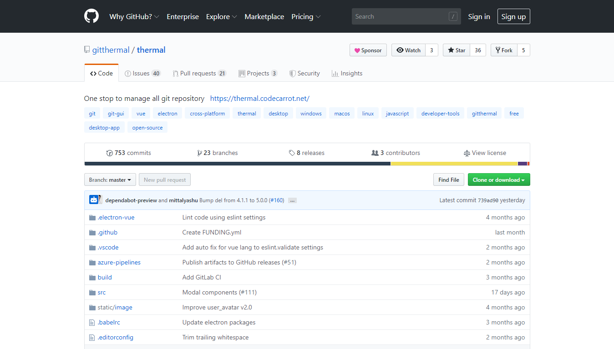
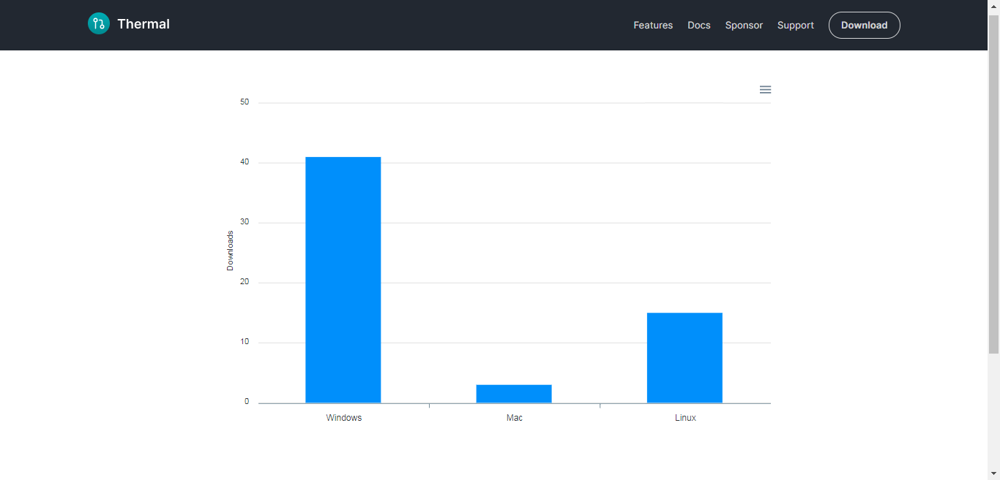
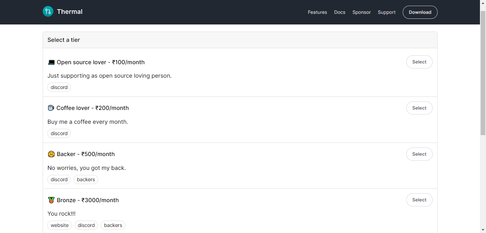

Hello, 👋🏻

I am building a free and open source developer tool called [Thermal](http://thermal.codecarrot.net/).

Thermal is a desktop application allows you to manage all Git repository at one place by providing you a simple to use graphic user interface with built-in features stats, history, diff preview, repository settings and [more](https://thermal.codecarrot.net/features).

---

Few stats to show the number of downloads for Windows, Mac, and Linux platform.

> MacOS downloads are low since it was released with v0.0.2.

You are most welcome 🙏🏻, to [download the application](https://thermal.codecarrot.net/) and share your feedback in [Thermal Discord community](https://discord.gg/vEVccH7).

Even though I am just getting started with it, there are a lot more features planned and yet to build and it can't be done without your help. [Becoming my sponsor](https://thermal.codecarrot.net/sponsor/) will help me a lot by keeping my ☕coffee mug full and encouraging me more that someone got my back 😉.

There are few perks for each sponsorship tier, let me know if you have any questions regarding the same.

> You can post questions in the comment section below or DM me on Discord Yashu Mittal#1475.

Again, you can become a sponsor from [thermal.codecarrot.net/sponsor](https://thermal.codecarrot.net/sponsor/)

Thank you so much for reading until the end.

🙏🏻
