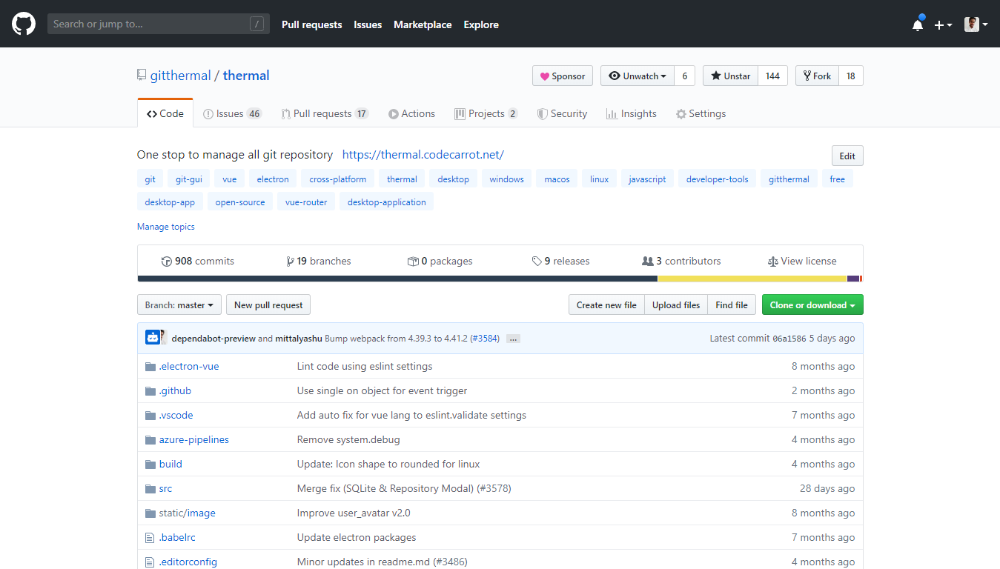
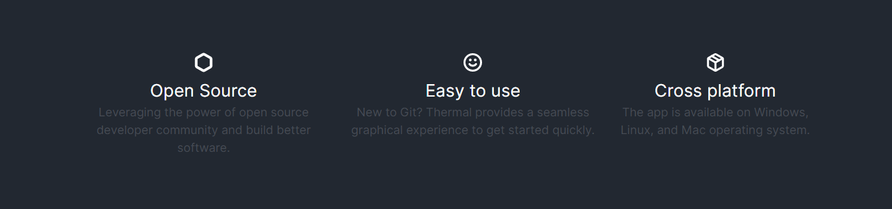
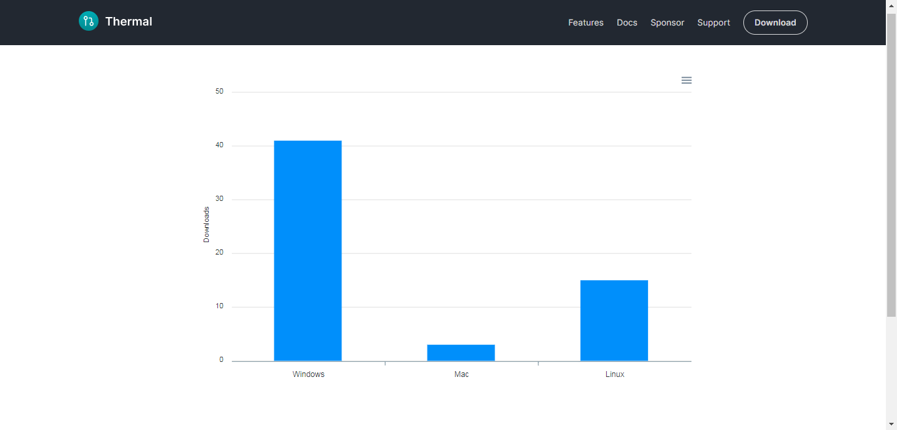
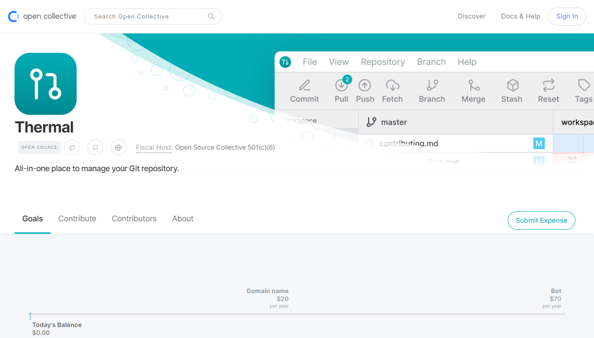

Hello, 👋🏻

I am building a free and open source developer tool called [Thermal](/).

Thermal is a desktop application allows you to manage all Git repository at one place by providing you a simple to use graphic user interface with built-in features stats, history, diff preview, repository settings and [more](https://thermal.codecarrot.net/features).

---

Here are some stats to show the number of downloads for Windows, Mac, and Linux.

You are most welcome to [download the app](https://thermal.codecarrot.net/) and do share your valuable feedback in [Thermal Discord community](https://discord.gg/vEVccH7).

Even though we're just getting started with it, there are a lot more features planned and yet to build and it can't be done without your help.

[Becoming a backer](https://opencollective.com/gitthermal) will help me a lot by keeping my ☕ coffee mug full and a constant reminder that you got my back 😉.

Each sponsorship tier has it's own perks, let me know if you have any questions regarding the same.

Thank you so much for reading until the end.

🙏🏻
