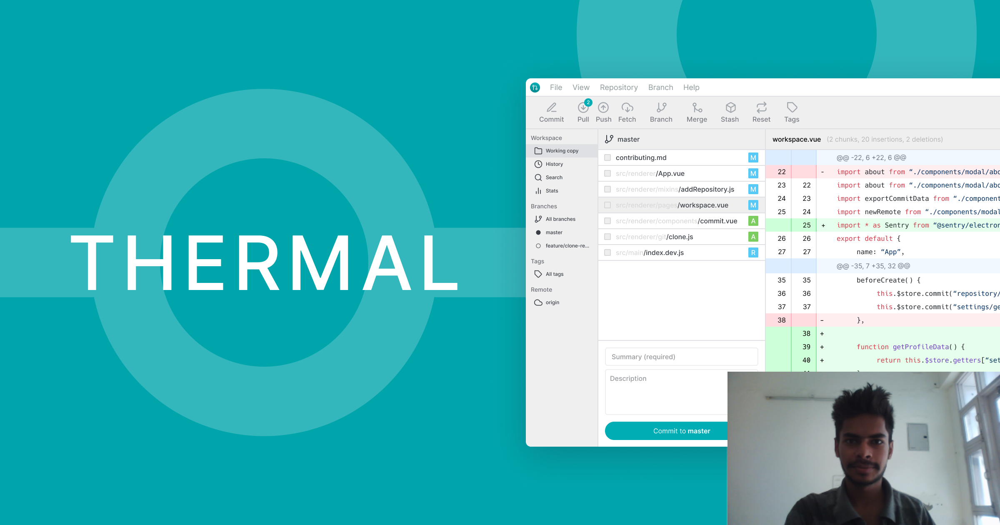

Hello Git users,

Today, I want to share about a very new Git GUI application which will blow your mind 🤯.

Now, before you ask, _"How it different from GitHub Desktop or Git Kraken?"_. There is only one answer to that, it's a lot different in terms of **goals**, **vision**, **price**, and **availability**.

Thermal is free, open-source, and cross-platform desktop application allows you to **manage your Git repositories at one place** by providing a simple to use graphic interface with built-in features like commits, history, repository settings and more.

_Looks cool? Huh!_

Wait ✋🏻, there more...

There are a lot of awesome features which comes _out of the box_.

- Repository stats
- Clone repository
- Create a new repository
- Commit changes
- History
- Commit details
- Code difference _(preview)_
- Repository settings
- Push to a remote repository
- and more.

Now... 🤔

Thermal is still a new software and there are a lot of features yet to build if you got too excited by looking at the image. All of the feature shown in the image might not be available yet, sorry for letting you down and few of them are still 🚧 work in progress.

But, worry not...

We want to make it easy for anyone to contribute to Thermal, whether you're helping us fix bugs, improve the docs, or spread the word, we'd love to have you as part of the Thermal community.

- **Website**: [https://thermal.codecarrot.net](https://thermal.codecarrot.net)
- **GitHub**: [https://github.com/gitthermal/thermal](https://github.com/gitthermal/thermal)
- **Discord**: [https://discord.gg/DcSNmts](https://discord.gg/DcSNmts)

Have any questions? You can message me in [Thermal Discord Server](https://discord.gg/DcSNmts).

Happy commits 😉

Thermal
