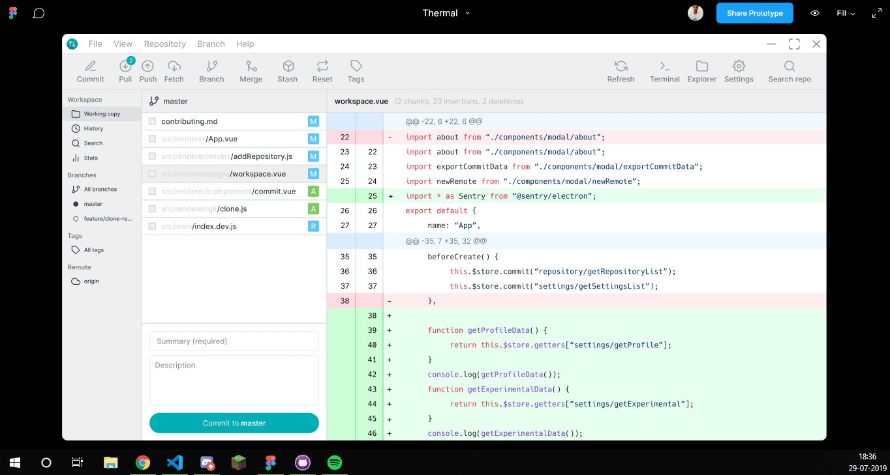

Which one of the following theme you would like to use in Thermal?

 _Thermal app in different theme (light, dark, atom dark)_

Please share your feedback about the theme you liked the most and what would you like to improve in the above design?

---

## What is this application about?

[Thermal](https://thermal.codecarrot.net/) is a free and cross-platform desktop application allows you to manage your Git repositories at one place by providing a simple to use graphic interface with built-in features like commits, history, repository settings and more.

_The source code of the application is available on [GitHub](http://github.com/gitthermal/thermal), and I would like to invite you to contribute, from writing code, logging bugs, submitting pull requests, reporting issues, creating suggestions, and more._

Please don’t forget to give an 🌟 on the GitHub repository too 😉.

Thanks

🖖🏻
