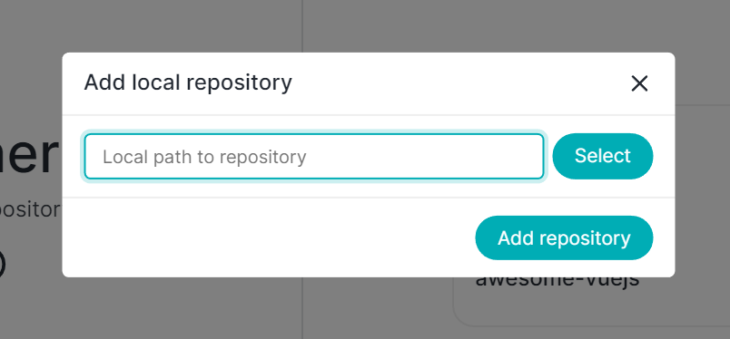

All the magic will happen once you start adding repositories to the Thermal app, there are multiple ways how you can add an existing local repository:

* Via the `Add repository` button, where you can select the folder from the dialog box.

* Via **drag and drop** - by dragging a folder from Explorer and dropping it onto the framed drop area.