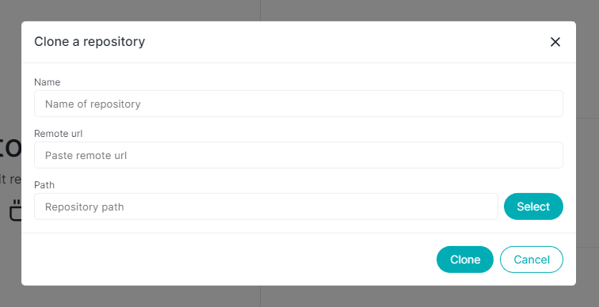

# Clone repository

You can clone an existing repository from a remote server via `Clone` button.

- Go to File menu
- Click on Clone repository
- Enter the name of the folder _(git content will be cloned into that folder)_
- Paste `https` remote url
- Select the path to clone repository
