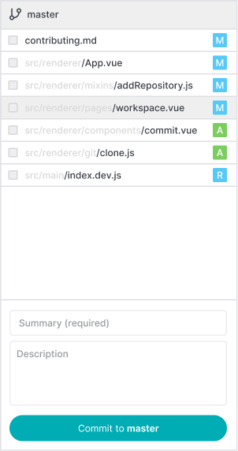

# Committing Changes

You can commit changes to your local repository in the workspace page. The Commit button is enabled as soon as...

* a commit subject was entered _(filling the "Extended Description" textfield is optional)_ and
* staged changes are present.

**NOTE:** Selecting a file for committing doesn't actually stage the file in Git.
