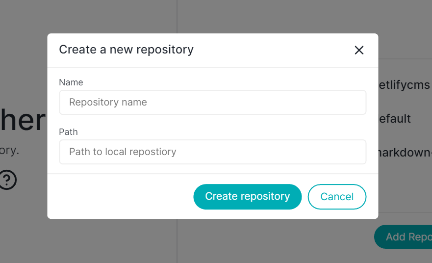

# Create repository

Creating a new & empty Git repository is like a breeze in Thermal application.

* Go to File menu
* Click on Create new repository
* Enter the name of the folder
* Select the path to new git repository

