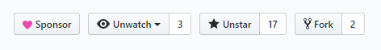

# Setup development environment

Setting up the Thermal development enviroment is easy as go. At it's core, Thermal is build using [Electron](https://electronjs.org/) & [Vue.js](https://vuejs.org)

## Clone repository

You can begin by [forking the repository](https://github.com/gitthermal/thermal) and later cloning the forked repository.

## Install packages

Thermal uses [Yarn](https://yarnpkg.com) to install, update, and manage the packages.

Run the `yarn` command inside the Thermal directory to install the packages.

## Run locally

Now you are ready to build the Thermal application locally.

_You can combine multiple script commands by `&&`, for example: `yarn lint:fix && yarn dev`._

- `yarn lint:fix`: Eslint lint and fixes the issues
- `yarn dev`: Run Thermal application locally.

> It's required but recommended to run `yarn lint:fix` command along with `yarn dev` command.
