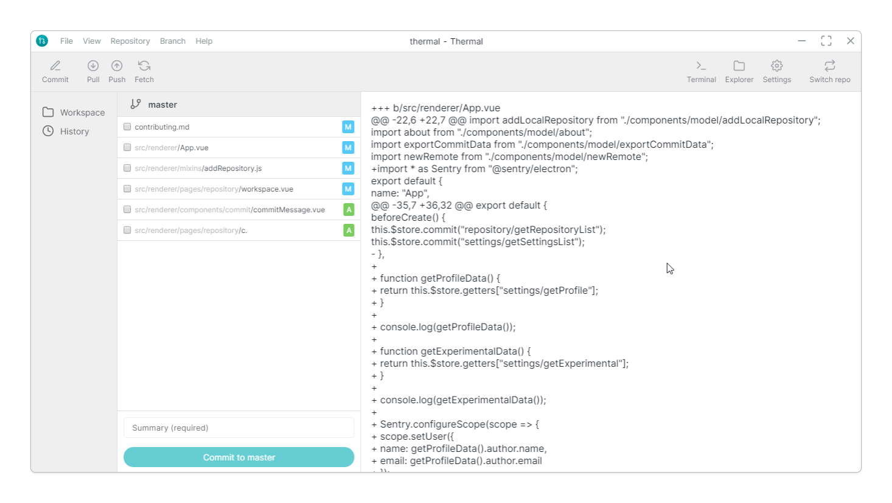

# Experimental features

> Experimental features are projects/features that aren't quite ready. They may break _(or disapper)_ at any time.

All these features can be enable from Options in menubar, toggle the feature you would like to use and, let us know what you think by joining our [Thermal Discord server](https://discord.gg/KT3nAR5).

## File diff

Show diff of a file in more visualized way, which includes additions and deletion of lines by adding numbering and color.

#### Options

- `true`
- `false`

## Commit description

Adding a short/long description to the commit is helpful to understand what the commit is actually about.

#### Options

- `True`
- `False`

## Powered by

Appending a short message in the description of a commit message.

#### Options

- ⚡ by [Thermal](https://thermal.netlify.com/)
- Commit ⚡ by [Thermal](https://thermal.netlify.com/)
- Try [Thermal](https://thermal.netlify.com/) for free
