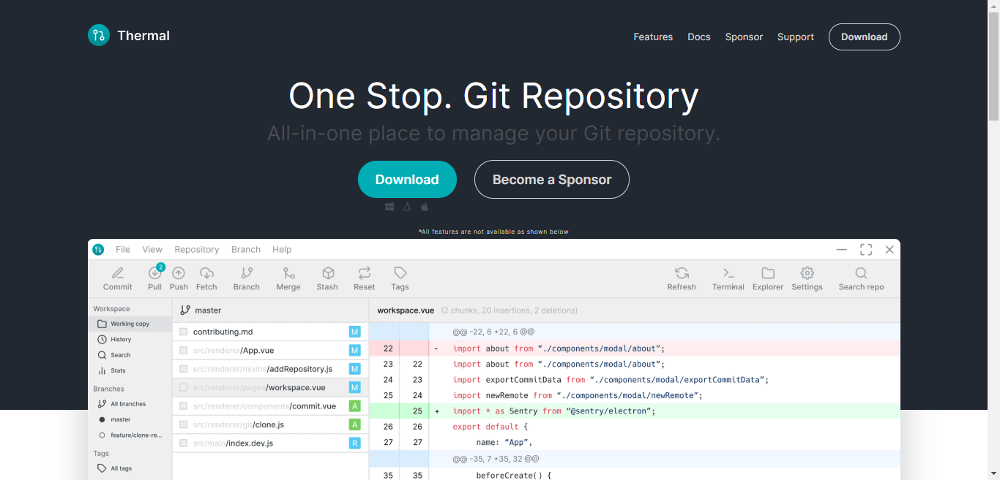
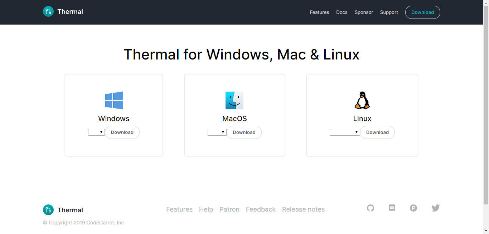

Installing Thermal should be fairly simple. Generally, you can go to [https://thermal.codecarrot.net](https://thermal.codecarrot.net) and you should see a download button as shown here:

You can download application for any operating system of your choice.

- There are no sign ups, just download, install and you are good to go.
- No Git tools are required, once you’ve run the installer, you can open the app and get going.
- It works directly with your repositories with no dependencies — you don’t even need to have Git installed on your system.

