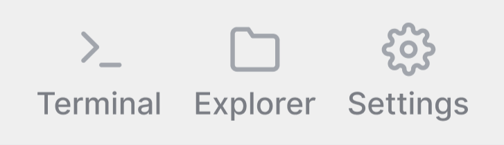

# Opening repositories

One of the most important actions in the Thermal is opening a repository to work with. Not only can you achieve this in a couple of different ways - you might also want to open a repository in other applications like Explorer or Terminal.

## Repository in Thermal

On the right side of the home screen is the list of all the local repositories, clicking on the `open` button will allow you to work on the repository.

After selecting a repository, you have access to all commands & information around the repository.

## Repository in Explorer & Terminal

You can open the selected repository in Explorer and Terminal by clicking on the respective icon in the toolbar.

