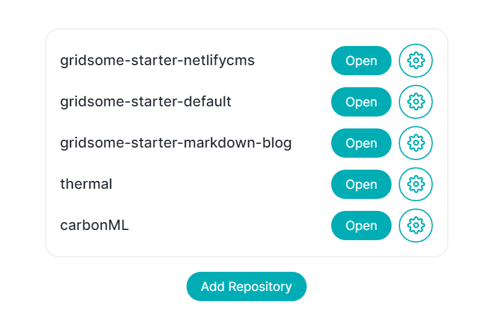

# Organizing repositories

You can easily organize repositories by adding and removing them.

## Add a repository

To add a repository, click on `Add repository` button on home screen. To learn different ways to add repository, go to [Add an existing repositroy](./add-existing-repository).

## Remove a repository

To remove an item from the list of repositories, click on the gear icon, you will re-directed to settings page, click on the **Remove button** in the danger zone.

> You can add the repository again, once you remove it.

