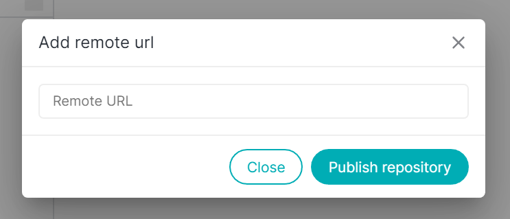

# Publishing a local repository

Projects are often started locally, on a developer's local hard drive. After some time, it might be become interesting to include a remote repository in the workflow - most notably in order to collaborate with others or just becuase sharing is caring.

With a couple of steps, you can easily publish your formerly local project on a remote server.

### 1. Add the local repository to Thermal

Firstly, make sure you've already **added the respective local repository to Thermal** _(see [Add an existing repository](./add-existing-repository) for more information)_.

If you have initalize a new Git repository or it doesn't have a remote url, instead of Pull, Push & Fetch, it will show you Publish.

### 2. Add the new remote repository in Thermal

With the local repository open in Thermal, connect the newly created remote repository. To do so, **click on Publish button** in the Thermal's navbar.

**NOTE:** If you have created a new Git repository, you need atleast one commit before you pushing your changes to a remote repository.

### 3. Paste remote URL

Paste the remote URL in the open modal and **click on Publish repository button**.

