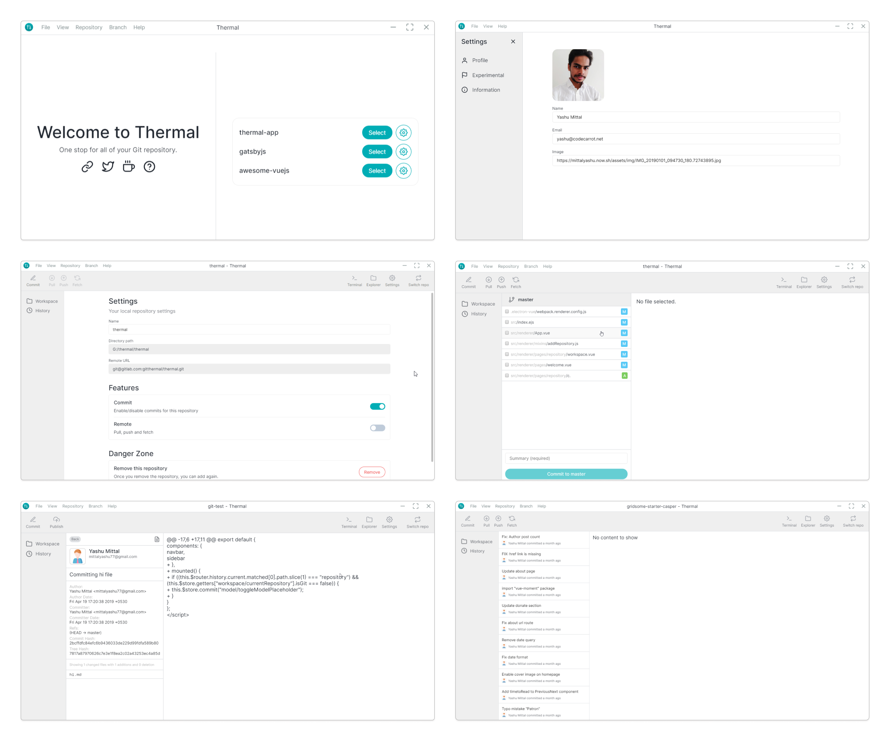
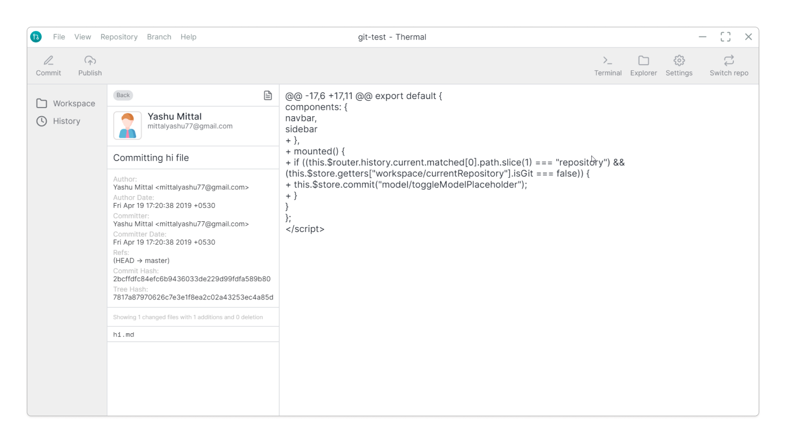
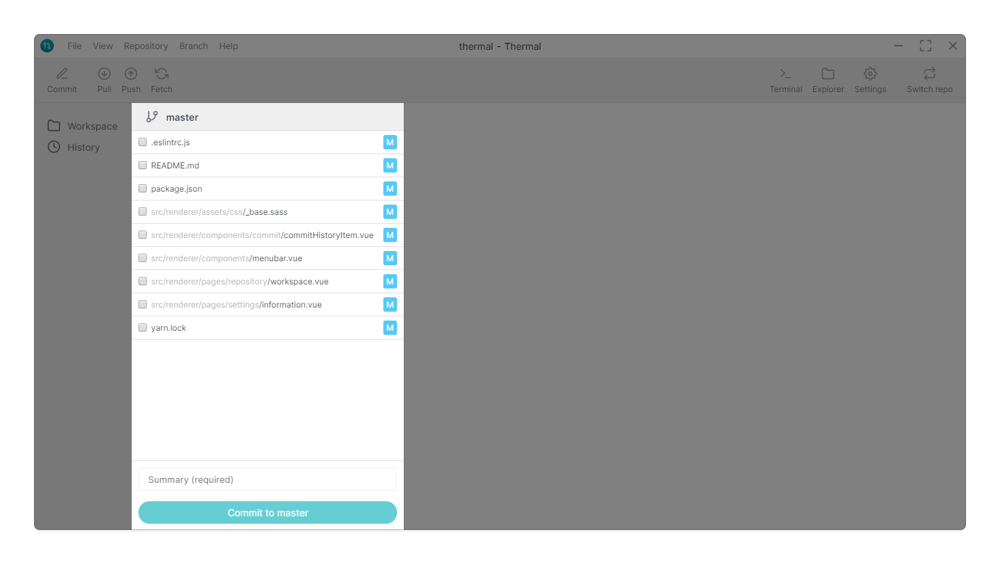
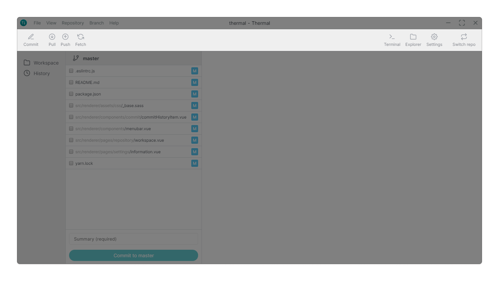
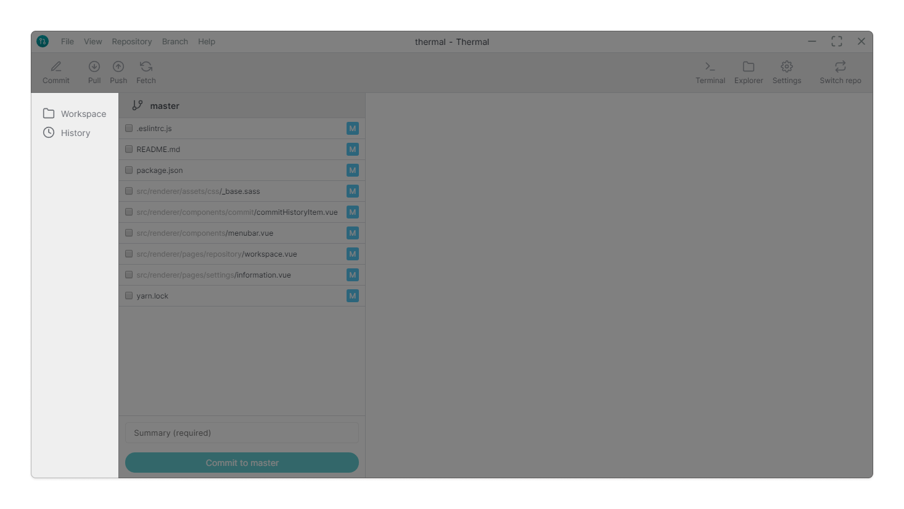
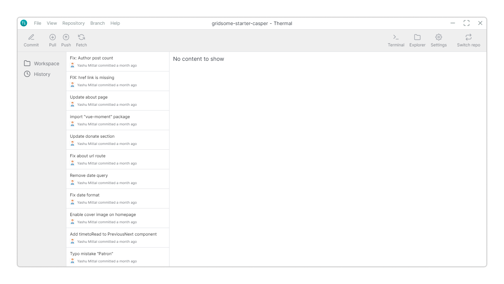

Here's a quick overview with few of the most important views in Thermal application.

It's here where you get an overview of modified files, commit changes, inspect previous commits, stashes, remote repositories and much more.

## Workspace

On the left side, you get an overview of any currently modified files.

##### Other features _(coming soon)_

- [File diff](https://github.com/gitthermal/thermal/issues/42)

## Toolbar

This toolbar is the main controller of the repository, on the left side, we have option to commit, pull, push, and fetch, on the opposite side, you can open the current select repository in terminal and explorer. Also change the settings of the repository and switch to another repository.

> Do you know, you can toggle feature like **Commit** and **Remote** from repository settings.

## Sidebar

Thermal's sidebar controls which aspect of a repository you're looking at or working with: simple select an item to get detailed information on the right.

##### Other features _(coming soon)_

- [Git tags](https://github.com/gitthermal/thermal/issues/28)
- [Push tags](https://github.com/gitthermal/thermal/issues/16)

## History

The History provides an overview of the repository's commit log. When a specific commit is selected on the left, it shows your commit meta data.

And on the right side you can preivew the detailed changes of the file.

## Settings

Update the name of the repository, toggle repository specific features like, commit and remote.

#### Commit

Commit feature allows to commit changes `git commit -a`.

#### Remote

Toggle features like pull, push and fetch.
