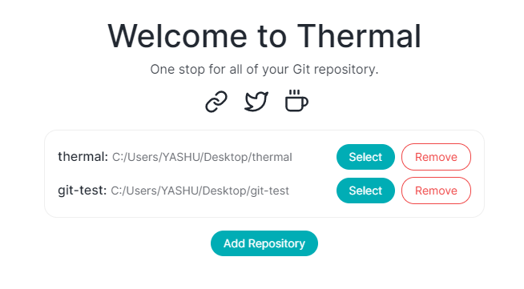
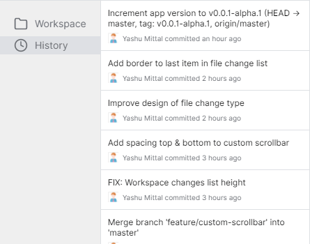
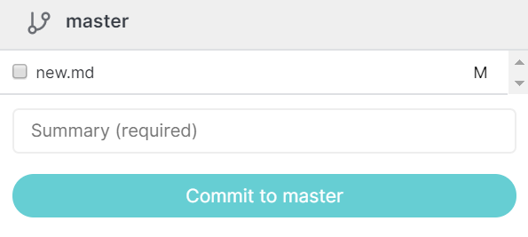
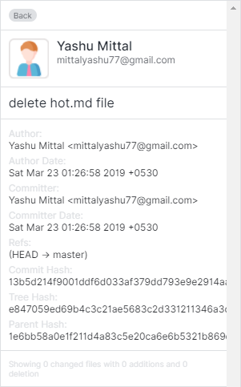
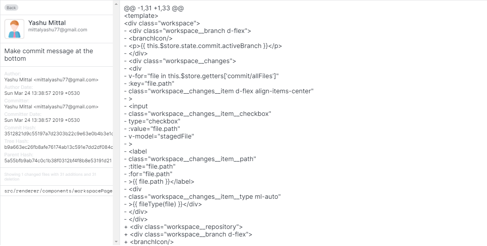

# 💡 Features

### Add local repository

Use Git features by adding local repository inside the app for quick access.

### Commit history

Allows you to see the list of commit history sorted from descending order.

### Commit files

You can select single/multiple files for committing, directly from the app.

### Commit detail

By clicking on a commit, you can preview the following detail of a commit:

- Author name, email, and date
- Commit title/description
- Committer name, email, and date
- Refs
- Commit hash
- Tree hash
- Parent hash
- File changes

### File preview

Preview file changes from the list of commit history.

# 🐞 Bug Fixes

- Unknown revision or path not in the working tree
