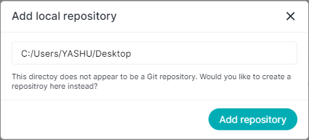
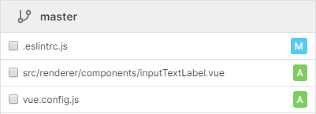

# 💡 Features

### Validate git repository

Before you add a local repository to the app, it will validate if it is a valid git repository or not.

### Custom scrollbar

Adding custom scrollbar give a personal touch from a brand perspective and with a smooth transition which scroll provides.

### Improve design of file change type

Get a quick insight from the color of the file type to check the status of the file.

# 🐞 Bug Fixes

- On opening the app, it was redirecting the user to page not found page on starting the app.
- Labels in the commit information were not readable due to brighten color.
- A long list of files changes makes the commit message run away from the view.
- Branch name not vertically aligned with an icon.
