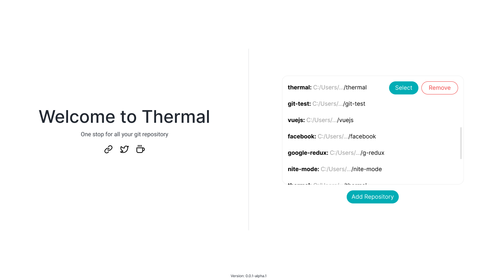
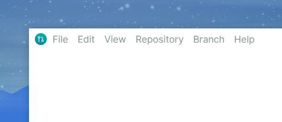
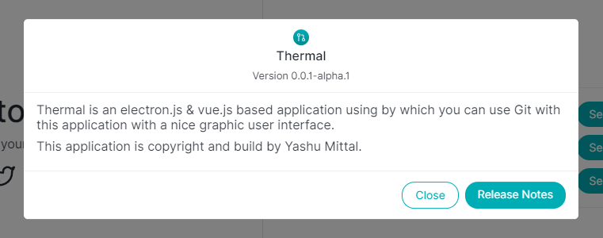

# 💡 Features

### Split welcome page & repository list

Creating a differentiation between the welcome page and repository list helps the user to understand the usage of the app.

### Custom menu bar

A custom menu gives the application a native feel and creates a good user experience, watch the [demo](https://youtu.be/JA-Wn7iAZGg).

### About the application

A page for showing information about the app, like version number and release notes.

# ⚙ Improvements

- Collecting error and log messages using sentry.
- Add local repository quickly by pasting the path of the directory and hit `enter` 😎.
- Close the model quickly by pressing `esc`.
