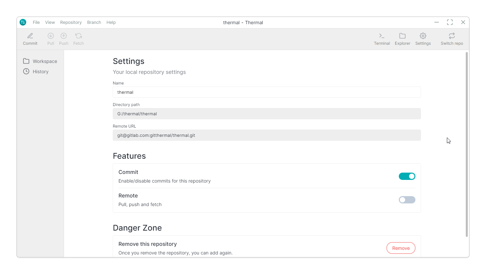
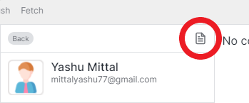
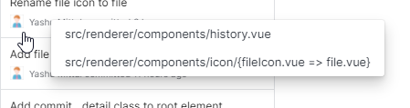

# 💡 Features

### Repository settings

You change settings for each repository and more options coming soon.

### Export commit data

With an easy export option, you can export the data of specific commit.

### Access file changes of commit real quick

Just by hovering on a commit for 5 seconds in history will show you the list of file changes.

# ⚙ Improvements

- Open file explorer in the current working directory.
- You can pull changes with a single click.
- Auto fetches remote URL upon adding a local repository.
- Click on Thermal logo will make you land directly to the homepage.
- Help `❓` icon on the welcome page, redirect you to [Thermal discord server](https://discord.gg/f5mYum8).
