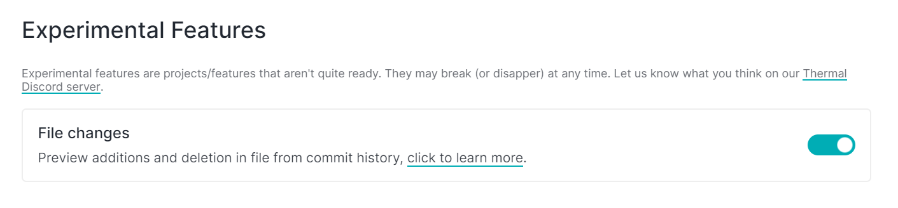

# 💡 Features

### App settings

You can tweak the settings like profile, experimental features, and information about the app, access all the settings from the file dropdown menu.

### Experimental features

Get access to some new and unstable features, by toggling the specific feature from experimental features page.

### Toggle repository features

Enable and disable features like commit and remote from repository settings.

### Repository name to menubar

Preview the name of the selected repository in the menu bar.

### Push changes to remote repository

Push local changes to a remote repository, just by adding the remote URL and hit the push button.

# ⚙ Improvements

- Auto fetches remote URL upon adding a local repository.
- Smooth scroll to the repository settings page.

# 👨🏻‍💻 Codebase

### Routing view and links

Use children routes to manage the routing across the application.

### Update package to the latest version to date _(7 April 2019)_

Update electron package to `v4.1.4`, babel to `v7.4.3`, eslint to `v5.16.0`, use all vue eslint configuration rules and upgrade the version of all other packages.
