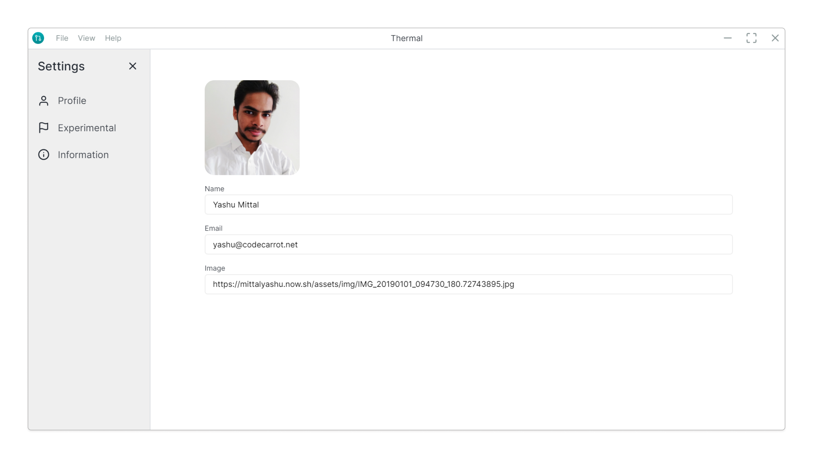
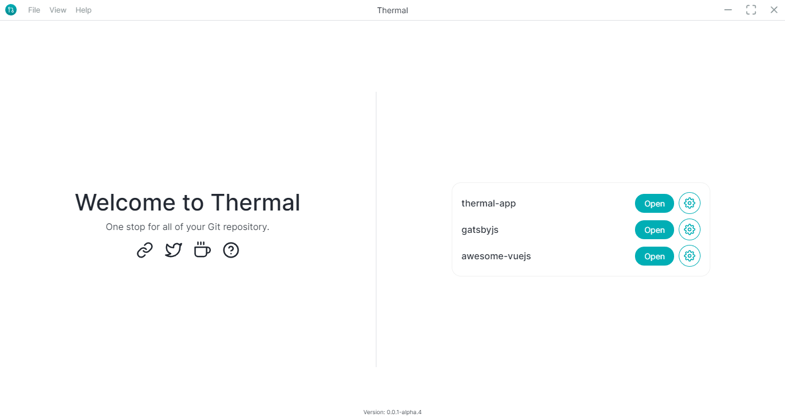
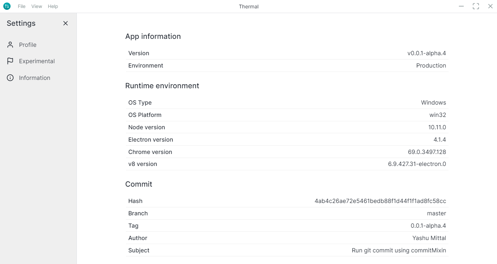
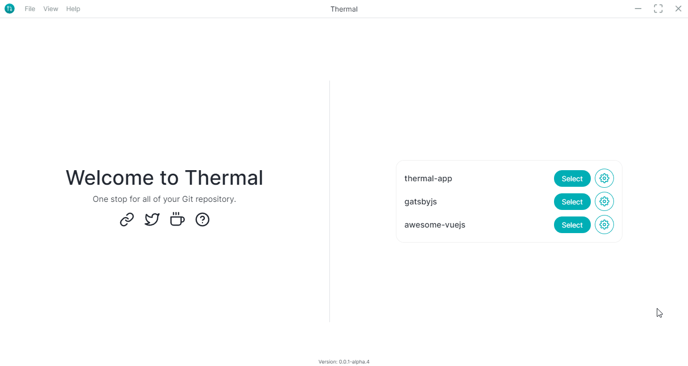
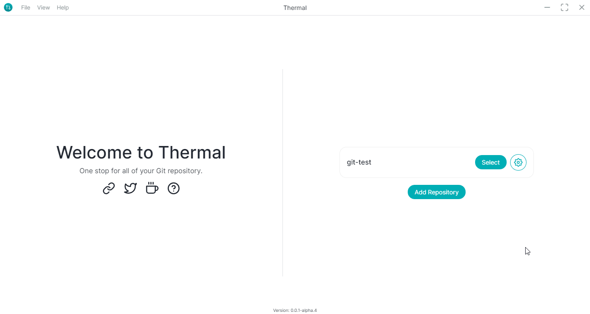
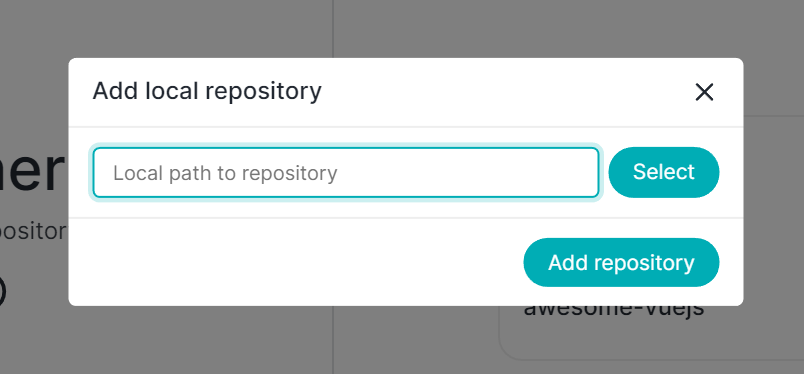
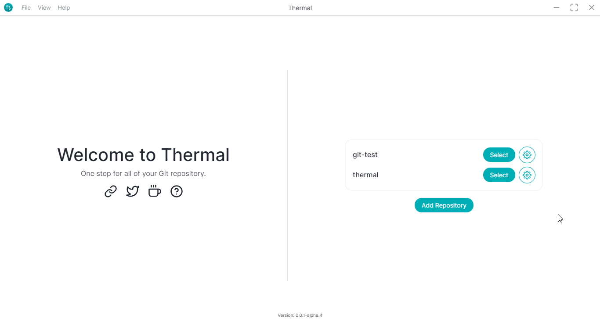

# 💡 Features

### Thermal on Linux

Now you can run Thermal application on your Linux operating system.

### Profile page

A profile page gives you options to create your own profile by adding a picture, name, and email.

### Drag and drop folders

Manually adding all those repositories is really hard, just to make it easy we added an option to drag and drop multiple folders at once.

### Information page

Showing the information about the application, from build to node version.

### Save repository locally

Your local added repositories now will be saved inside a localStorage so that you don't have to add them again and again.

### Text editor in CWD

Open your preferred text editor directly from the application inside the selected repository.

### Folder picker

Adding folder picker allows you to pick any folder from any location with a click of a `select` button.

### Open explorer in CWD

Open the selected workspace in file explorer with a click of a button.

### Open Terminal in CWD

Just like explorer you can also open terminal of a selected workspace.

# ⚙ Improvements

### Welcome page

Want quick access to welcome page, just go to welcome page from the menubar.

### Scroll to commit information

Add a custom scrollbar to commit information panel.

### Toggle full screen

Adding an option in the menubar to toggle full-screen view.

# 🐞 Bug Fixes

### Dev-tools opens automatically

Preventing from dev-tools to open automatically on launching the application.

### Hidden repository list from scroll

Due to the spacing problem around the repository list, it was a causing problem to the scroll.

### Commit button enabled without selecting any file

# 👨🏻‍💻 Codebase

### Integrate sentry releases

With the integration of sentry release, it knows from which release the event report came from.
