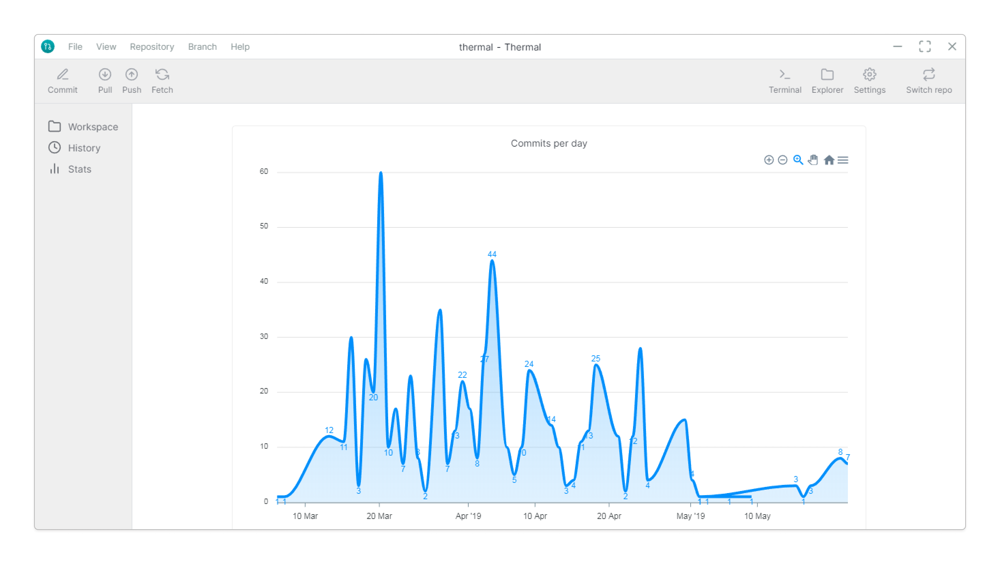
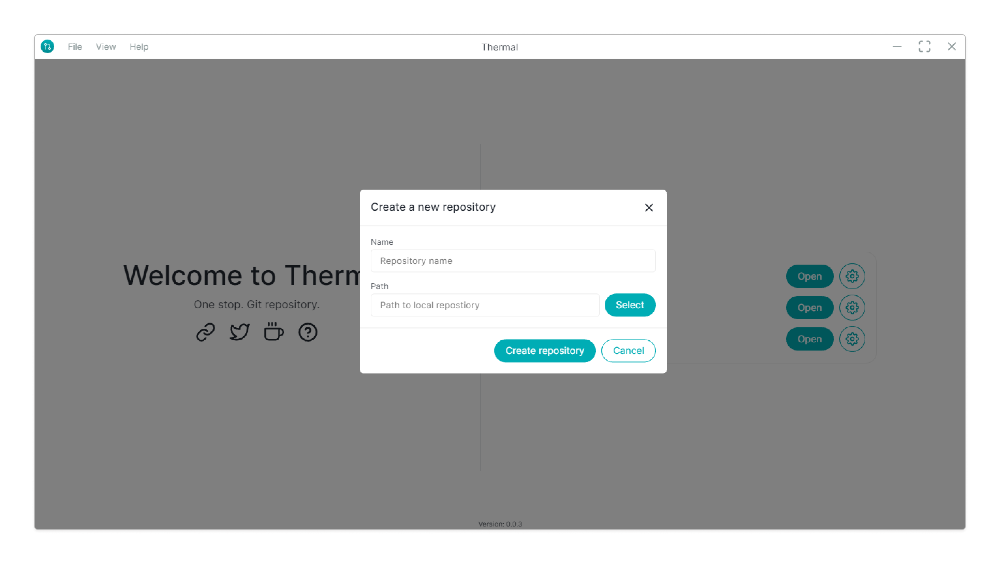
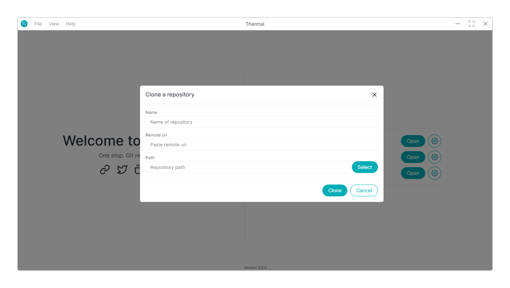
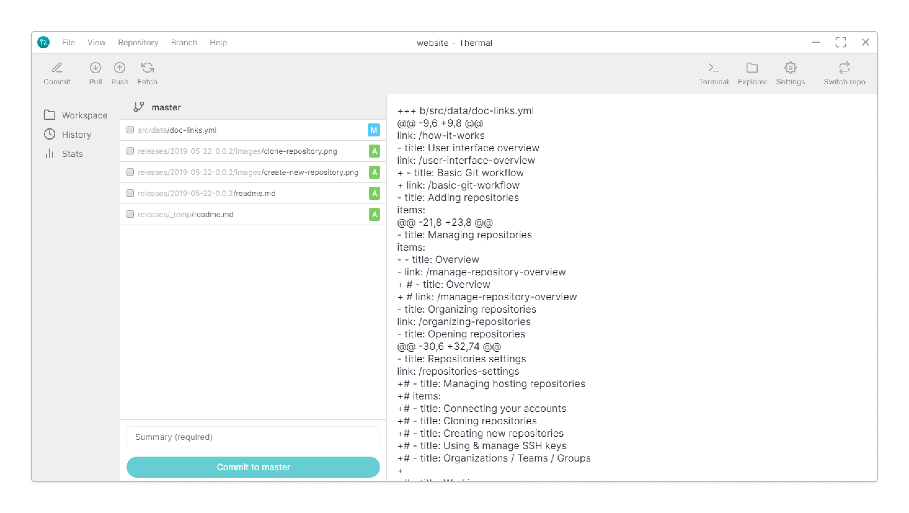
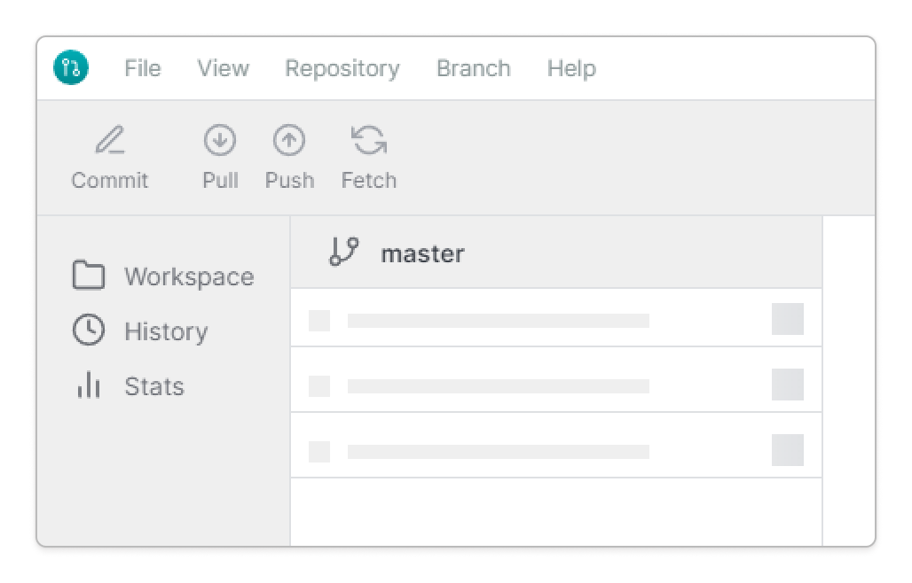
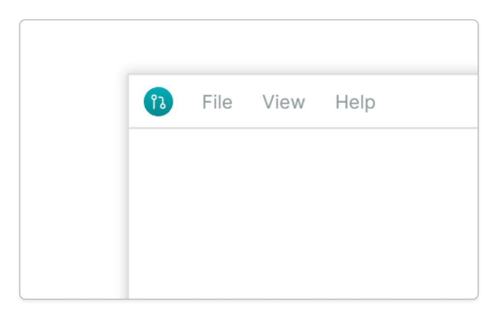

## 💡 Features

### Repository stats

Get the gist of commits you or your team has made on number of days.

### Create new repository

Creating a new git repository has never been so easy, enter the name of the directory and select the path where you want to create the git repository.

Learn more about [create new repository](/docs/create-repository) feature.

### Clone repository

Downloading repository in `.zip` format can be bit too much! That's why with clone repository feature, it's easy as go.

Learn more about [clone repository](/docs/clone-repository) feature.

### File diff in the workspace

Clicking on the file changes will show you the diff of the file on the right side.

### Initialize Git repository

You can add non-git directory to the Thermal application and it gives you handy option to initalize the git repository with a click of a button.

## ⚙ Improvements

### Loading skeleton

While the data is loading, it's too boring just look at white screen, showing the loading skeleton ensures you that your content is on the way.

### Bordered window

Added a light border around applications, as it could be hard to see the window without borders.

## 🐞 Bug Fixes

- Missing repository path - [#23](https://github.com/gitthermal/thermal/issues/23)

## 👨🏻‍💻 Codebase

- Dropdown components - [#6](https://github.com/gitthermal/thermal/pull/6)
- Use Azure pipelines - [#9](https://github.com/gitthermal/thermal/pull/9)
- Publish artifacts to GitHub releases - [#51](https://github.com/gitthermal/thermal/pull/51)
